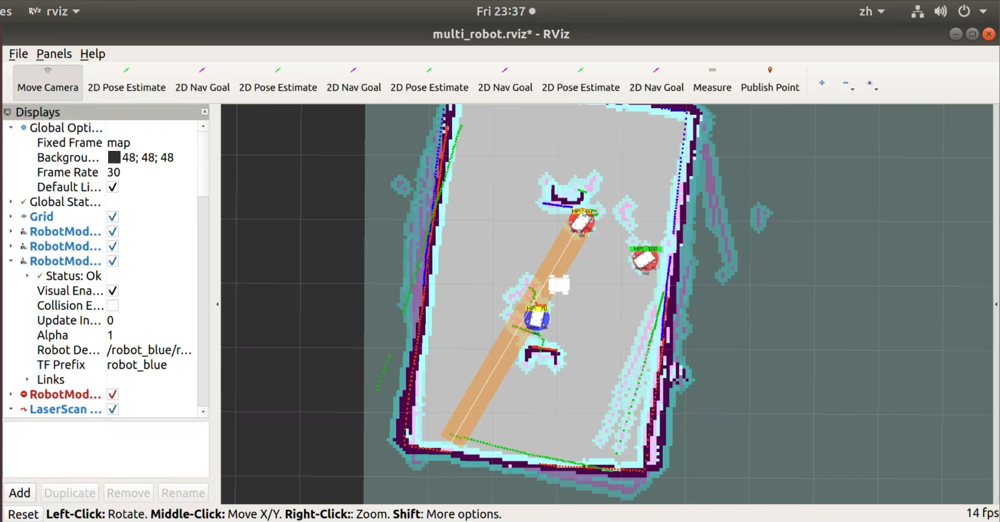
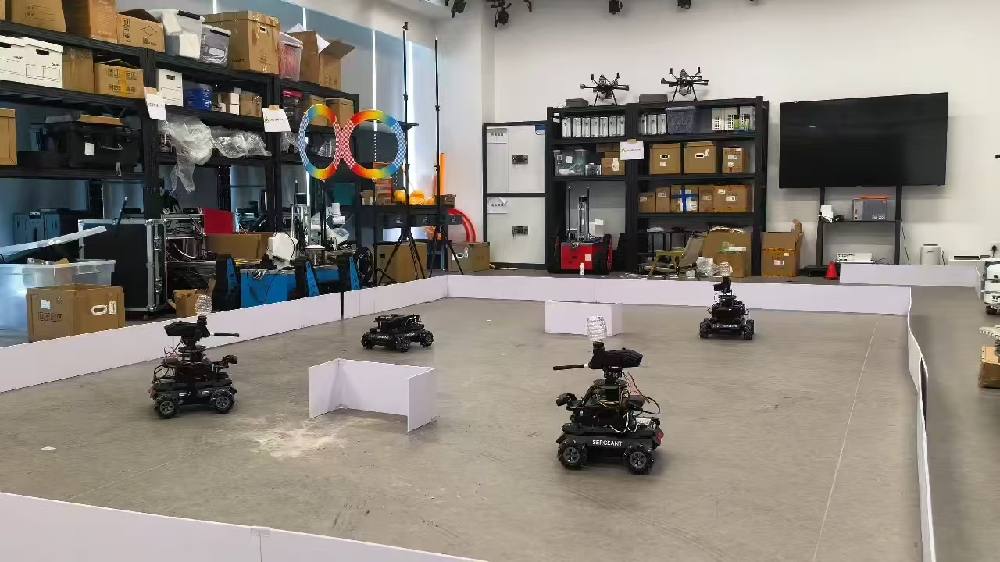

# robot_vs

robot_vs 是一个可接入大模型多智能体机器人红蓝对抗系统，覆盖仿真与真机运行，支持规则/LLM/MAS多智能体 分层决策，并提供裁判与可视化能力。

## 演示 / Demo

### 仿真环境


### 真机运行


## 项目亮点
- Manager + Car Agent + Skill 三层控制架构
- LLM 决策与 MAS 分层多智能体规划，并且与对抗系统完全解耦
- - Referee 裁判系统：命中、血量、弹药、可见性
- 支持 GOTO / STOP / ATTACK / ROTATE 原子动作
- - Gazebo 仿真 + 真机运行统一话题结构

## 架构概览
- **Manager**：汇总战场状态并下发 `TaskCommand`
- **Car Agent**：任务执行与状态回传 `RobotState`
- **Skill**：原子动作库（导航/攻击/旋转）
- **Referee**：裁判仲裁与可见敌人统计
- **MAS**：LeaderAgent（慢）+ CarAgent（快）分层 LLM 决策

详细架构与数据流请见文档索引。

## 文档索引
| 文档 | 内容 |
| ------ | ------ |
| [环境配置](INSTALL.md) | 环境准备与项目初始化 |
| [对抗平台技术原理](TECHNICAL.md) | ROS 多机器人通信、裁判机制、消息流 |
| [多智能体MAS框架技术文档](MAS.md) | MAS 分层多智能体决策与配置 |

## 快速开始（精简）
```bash
cd ~/catkin_ws/src
git clone https://github.com/Xqrion/robot_vs.git
cd ~/catkin_ws
catkin_make
source devel/setup.bash
```

### 启动 2v2 仿真
```bash
roslaunch robot_vs simulation/2v2vs_simulation.launch
```

### 启动 LLM / MAS 服务
```bash
# LLM (传统单体)
bash config/AI/start_llm_services.sh

# MAS (分层多智能体)
bash config/AI/start_mas_services.sh
```

更多运行细节与参数请参考上方文档。


